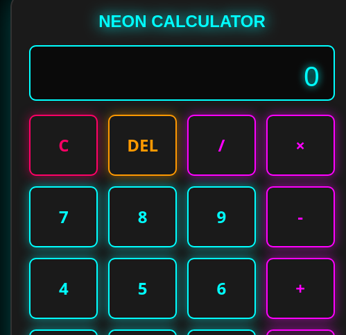

# Neon Calculator

A Pen created on CodePen.

Original URL: [https://codepen.io/tatiane-nascimento/pen/PwZzaBb](https://codepen.io/tatiane-nascimento/pen/PwZzaBb).
# 💡 Calculadora Neon (Neon Calculator)

## ✨ Visão Geral

A **Calculadora Neon** é um projeto moderno e responsivo, desenvolvido com HTML, CSS e JavaScript puro. Inspirada na estética **dark mode** e no design **cyberpunk/synthwave**, ela oferece uma experiência de usuário visualmente impressionante.

Este projeto é ideal para quem busca um portfólio front-end leve, com foco em design e interatividade.

---

## 🔗 Acesse e Teste o Projeto

Teste a calculadora ao vivo: **[Calculadora Neon Online](https://tatiane347.github.io/Calculadora-Neon/)**

---

## 📸 Visualização do Projeto

---

## 🛠️ Tecnologias Utilizadas

| Tecnologia | Finalidade Principal |
| :--- | :--- |
| **HTML5** | Estrutura semântica dos elementos. |
| **CSS3** | Estilização completa, uso de `box-shadow` e `text-shadow` para o **efeito neon glow** e layout Grid para os botões. |
| **JavaScript (Puro)**| Lógica de cálculo, manipulação do display e suporte completo à interação via teclado. |

---

## 💼 Contrate a Desenvolvedora!

Procuro novas oportunidades de trabalho em tempo integral ou projetos *freelancer*.

Se você é um recrutador ou tem um projeto que precisa de uma desenvolvedora Front-end focada em qualidade e experiência de usuário, entre em contato!

* **Perfil LinkedIn:** [Tatiane Nascimento](https://www.linkedin.com/in/tatiane-nascimento-68b0622bb/)
* **Email:** `tatianen25@gmail.com`
* **WhatsApp:** `+55 (11) 91052-6709`

